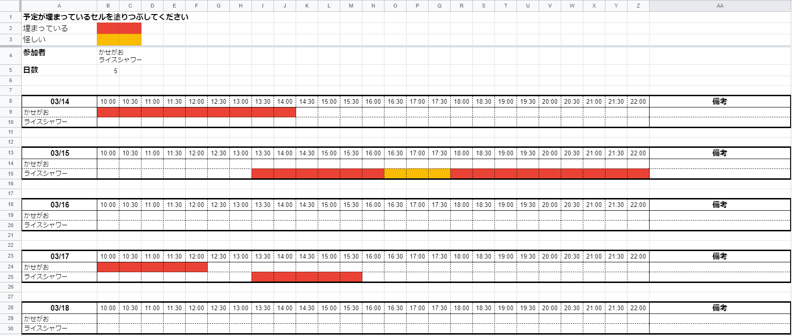
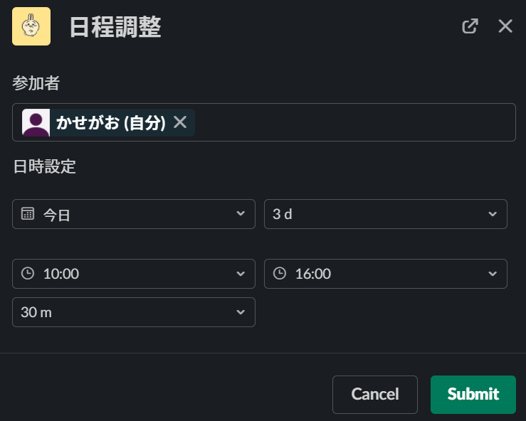
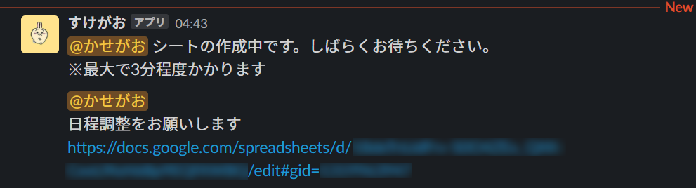

# すけがお

日程調整用のスプレッドシートを自動生成する Slack bot です。



## Quick Start

### Slack app の設定

Slack app を作成します。

まず **Incoming Webhooks** を有効化し、
次に **OAuth & Permissions** にて Bot Token Scopes に以下の三つを設定してください。

- `commands`
- `incoming-webhook`
- `users:read`

完了したら Slack Bot を適当なスケジュール調整用のチャンネルにインストールしてください。  
後ほど GAS をデプロイした後に **Interactivity & Shortcuts** の設定を行います。

### スプレッドシートの作成

[Google Spreadsheet](https://docs.google.com/spreadsheets/u/0/) にアクセスし、スプレッドシートを一つ作成します。
このスプレッドシートの ID（`https://docs.google.com/spreadsheets/d/<SpreadsheetId>/edit#gid=0` の `<SpreadsheetId>` 部分）を控えておいてください。

日程調整を行うたびに、このスプレッドシートに新しくシートが追加されていきます。  
したがって、**スケジュール調整を行う参加者全員がこのスプレッドシートの編集権限を持っている必要があります**

### GAS の設定

#### ローカルの作業

本リポジトリを clone します。

```bash
git clone git@github.com:Kasega0/Schega0.git
cd Schega0
cp src/env.ts.example src/env.ts
```

設定ファイル [src/env.ts](./src/env.ts.example) に各種値を設定。

```ts
export class Config {
  public app_token = () => ''
  public bot_token = () => 'xoxb-'
  public callback_id = () => 'schega0'
  public webhook_url = () => 'https://hooks.slack.com/services/XXXXXXXXXX'
  public ss_key = () => 'xxxxxx'
}
```

- `app_token`: Slack App の Verification Token
- `bot_token`: Slack Bot の Bot User OAuth Token
- `callback_id`: アプリケーションの識別子（任意）
- `webhook_url`: Incoming Webhooks の Webhook URL
- `ss_key`: 先ほど控えたスプレッドシートの ID

#### デプロイ作業

新規 **webapp** を作成。（clasp を導入していない場合は手動で設置してください）

```bash
$ clasp create sample_app
? Create which script? (Use arrow keys)
  standalone
  docs
  sheets
  slides
  forms
❯ webapp
  api
```

初めて clasp を用いる場合、次のエラーがでる場合があります。その場合は指示通り <https://script.google.com/home/usersettings> へアクセスして Google Apps Script API を有効化してください。

> User has not enabled the Apps Script API. Enable it by visiting <https://script.google.com/home/usersettings> then retry. If you enabled this API recently, wait a few minutes for the action to propagate to our systems and retry.

`appsscript.json` の設定

次のように `webapp` 用の設定を追加してください。その他の項目はお好みで設定してください。

```json
{
  "timeZone": "Asia/Tokyo",
  "dependencies": {},
  "exceptionLogging": "STACKDRIVER",
  "runtimeVersion": "V8",
  "webapp": {
    "access": "ANYONE_ANONYMOUS",
    "executeAs": "USER_DEPLOYING"
  }
}
```

GAS プロジェクトにアップロード \& デプロイ

```bash
clasp push
clasp deploy
```

`clasp deploy` 後に表示されるデプロイ ID からデプロイ先の URL が分かります。  
`https://script.google.com/macros/s/<DeployId>/exec`

GUI で確認したい場合は `clasp open` を実行して「デプロイ」＞「デプロイを管理」から確認できます。

### 再び Slack app の設定

最後に Slack app の **Interactivity & Shortcuts** に移動し、 Interactivity を有効化します。
`Request URL` には先ほどデプロイした GAS の URL を設定してください。

またショートカットを一つ作成します。その際、`callback_id` には `env.ts` に設定したものと同じ値を設定してください。

以上でセットアップは完了です。

## 使い方

Slack のショートカットから先ほど設定した日程調整を実行します。

図のようなモーダルが表示されるので以下の項目を設定してください。

- 参加者
- 調整開始日
- 調整日数
- 調整開始時間
- 調整修了時間
- 調整時間間隔



送信して少し待つと Bot から通知が届きます。



始めの通知はショートカット使用者にのみ、二回目の通知は調整参加者全員にメンションされます。

## 開発者用

TODO: 追記

```bash
git config --local core.hooksPath .githooks
```
